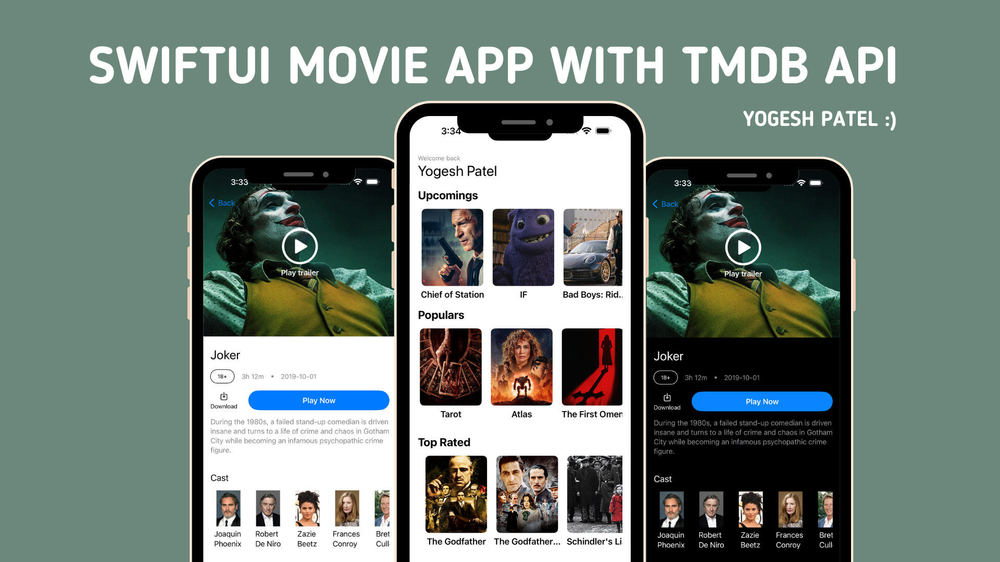

# SwiftUI Movie App Using TMDB API

Welcome to the SwiftUI Movie App! This project leverages the TMDB API to display upcoming, top-rated, and popular movies. By clicking on any movie, users can view detailed information including the cast, description, image, title, length, and language.



## Features
- **Home Screen:** Browse upcoming, top-rated, and popular movies.
- **Movie Details:** Get comprehensive details about each movie, including cast, description, and more.
- **SwiftUI:** Built entirely with SwiftUI for a smooth and responsive UI.

## Installation
1. Clone the repository:
   ```bash
   git clone https://github.com/YogeshPateliOS/TMDBMovieApp.git
2. Navigate to the project directory and open it with Xcode.
3. Create an API key from the [TMDB Documentation](https://developer.themoviedb.org/reference/intro/getting-started).
4. Add your TMDB API key to the API key property in the MovieEndPoint file
5. Build and run the app on your simulator or device.
